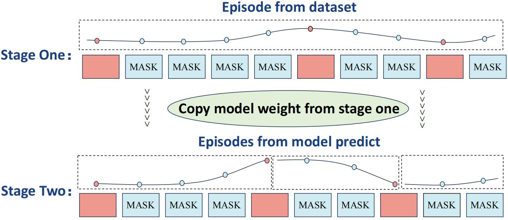

<h1 align="center">Corki: Algorithm-Architecture Co-Design for Embodied
AI-powered Robotic Manipulation</h1>


[](https://arxiv.org/abs/2407.04292)

This is also the official code repo for the paper [Software-Hardware Co-Design For Embodied AI
Robots](https://arxiv.org/pdf/2407.04292), the conference version will come soon.

If you have any questions about the paper and code, please contact us huangyiyang24@mails.ucas.ac.cn. We will reply as soon as possible.

All our experiments are conducted on a server with 8 Nvidia A100 GPUs (80G).

## 📰 News

- **[2025-03-22]** - 🎉 **Our paper has been accepted to ISCA 2025!** 🎉 
- **[2024-09-05]** - We release our code.

## :white_check_mark: TODO
**If you have any idea to make this repo better, please contact us and thank you.**
- [x] Fix the command typos
- [ ] Docker environment
- [ ] Faster Calvin dataset access
- [ ] Mark all paths need to change
- [ ] Corki checkpoint 

## Download the Calvin dataset and models:

Our repository is built based on the work RoboFlamingo. You can also follow the [RoboFlamingo](https://github.com/RoboFlamingo/RoboFlamingo)  to download the corresponding [OpenFlamingo](https://github.com/mlfoundations/open_flamingo) model checkpoints, conda environment, and the [Calvin](https://github.com/mees/calvin) dataset, or just follow the instructions below:

``` bash
# Install the Calvin simulation(from https://github.com/mees/calvin)
git clone --recurse-submodules https://github.com/mees/calvin.git
export CALVIN_ROOT=$(pwd)/calvin
cd $CALVIN_ROOT
conda create -n corki python=3.8  # or use virtualenv
conda activate corki
sh install.sh

# Download the Calvin Datasets
cd $CALVIN_ROOT/dataset
# choose D / ABC to download the datasets, D is approximately 166GB, ABC is apporximately 600GB
sh download_data.sh D | ABC

# Clone the Corki repository
git clone https://github.com/hyy02/Corki.git
cd Corki
conda activate corki
# If you encounter issues while installing torch, torchaudio, or torchvision.
# You can either remove the version constraints in requirements.txt or use the following commands instead:
pip install -r requirements.txt

# Install the torch 1.12.1+cu113 (https://download.pytorch.org/whl/cu113/)
wget https://download.pytorch.org/whl/cu113/torch-1.12.1%2Bcu113-cp38-cp38-linux_x86_64.whl#sha256=4adf483ac2d047534a7d023f0022bd8694d87627068ad6dddf186cb3273bbfa2
wget https://download.pytorch.org/whl/cu113/torchvision-0.13.1%2Bcu113-cp38-cp38-linux_x86_64.whl#sha256=899cac298d2a7cf6a8ca62d3ede2a7d3f50b86027f8be2d15639baf74da5d8f0
wget https://download.pytorch.org/whl/cu113/torchaudio-0.12.1%2Bcu113-cp38-cp38-linux_x86_64.whl#sha256=07324a67c069a986bb991c509c9442e8fce72326941e55fa4738d88cbb806047
pip install torch-1.12.1+cu113-cp38-cp38-linux_x86_64.whl
pip install torchaudio-0.12.1+cu113-cp38-cp38-linux_x86_64.whl
pip install torchvision-0.13.1+cu113-cp38-cp38-linux_x86_64.whl

# Download the hugginface models use huggingface-cli tool, you can use other tools as well
pip install huggingface_hub
huggingface-cli download --resume-download openflamingo/OpenFlamingo-3B-vitl-mpt1b-langinstruct --local-dir openflamingo/OpenFlamingo-3B-vitl-mpt1b-langinstruct # your local dir
```
After you've done these steps, replace all the conda environment path, data path, and OpenFlamingo model checkpoint path in the code with your local path, for example:

[Conda Environment path](https://github.com/hyy02/Corki/blob/85b97c9766903c03d29041fdd29020a9cc6e97f7/tools/train.sh#L7)

[Calvin Dataset path](https://github.com/hyy02/Corki/blob/85b97c9766903c03d29041fdd29020a9cc6e97f7/robot_flamingo/configs/robot_flamingo_episode_sum_multi_9steps_take_5steps.args#L11)

[OpenFlamingo Model path](https://github.com/hyy02/Corki/blob/85b97c9766903c03d29041fdd29020a9cc6e97f7/robot_flamingo/models/factory.py#L24)


## Training the model (using DDP):

#### Corki-N

``` bash
bash tools/train.sh robot_flamingo/configs/robot_flamingo_episode_sum_multi_9steps_take_5steps.args
```

You can train **Corki-n** by modifying the `take_steps` value to `n` in the file `robot_flamingo/configs/robot_flamingo_episode_sum_multi_9steps_take_5steps.args`

#### Corki-ADAP

Adaptive training is divided into two stages:

<div align="center">

</div>


- In the first stage, we use the episodes in the dataset to get proper adaptive steps through our waypoints extraction algorithm, in order to make the trajectories predicted by the model easier to converge, so we train 5 epochs first.

  ```bash
  bash tools/train.sh robot_flamingo/configs/robot_flamingo_episode_adaptive.args
  ```

- In the second stage, we will extract waypoints from the trajectory predicted by the model during the inference time to determine how many steps to accelerate. Therefore, in order to ensure that our training is consistent with our evaluation process, we use the final checkpoint from the first stage to continue training. In this 5 epochs training, we will use the predicted trajectory to extract waypoints.

  ```bash
  bash tools/train.sh robot_flamingo/configs/robot_flamingo_episode_sum_adaptive_model_output.args
  ```

## Evaluating the model on the CALVIN benchmark

```
bash eval_ckpts.bash
```

- Make sure you use the same configuration as your training before testing, If you change the configuration in training, you need to change `robot_flamingo/pt_eval_ckpts.bash` during testing.

  ```bash
  # Example for Corki-5,make sure they are same with the .args files you used in training
  if [ ${use_gripper} -eq 1 ] && [ ${use_state} -eq 0 ]
  then
  torchrun --nnodes=1 --nproc_per_node=${node_num}  --master_port=6099 robot_flamingo/eval/eval_calvin.py \
      --precision fp32 \
      --use_gripper \
      --window_size ${window_size} \
      --fusion_mode ${fusion_mode} \
      --run_name RobotFlamingoDBG \
      --calvin_dataset ${calvin_dataset_path} \
      --lm_path ${lm_path} \
      --tokenizer_path ${tokenizer_path} \
      --cross_attn_every_n_layers 4 \
      --evaluate_from_checkpoint ${evaluate_from_checkpoint} \
      --calvin_conf_path ${calvin_conf_path} \
      --use_episode \
      --multi_step_action 9
      --action_num 5 \ # the same with the take_steps in training
      --mask_ratio 0.2 \
      --episode_loss point_sum \
      --workers 1 |& tee -a ${log_file}
  ```

## Contact

If you have any confusion about this repo, feel free to send an email to [huangyiyang24@mails.ucas.ac.cn](huangyiyang24@mails.ucas.ac.cn) or raise an issue, we will reply and improve as soon as possible.

## Acknowledgment

#### CALVIN

Original:  [https://github.com/mees/calvin](https://github.com/mees/calvin)
License: [MIT](https://github.com/mees/calvin/blob/main/LICENSE)

#### OpenAI CLIP

Original: [https://github.com/openai/CLIP](https://github.com/openai/CLIP)
License: [MIT](https://github.com/openai/CLIP/blob/main/LICENSE)

#### OpenFlamingo

Original: [https://github.com/mlfoundations/open_flamingo](https://github.com/mlfoundations/open_flamingo)
License: [MIT](https://github.com/mlfoundations/open_flamingo/blob/main/LICENSE)

#### RoboFlamingo

Original: [https://github.com/RoboFlamingo/RoboFlamingo](https://github.com/RoboFlamingo/RoboFlamingo)
License: [MIT](https://github.com/RoboFlamingo/RoboFlamingo/blob/main/LICENSE)

## Lisense
MIT
